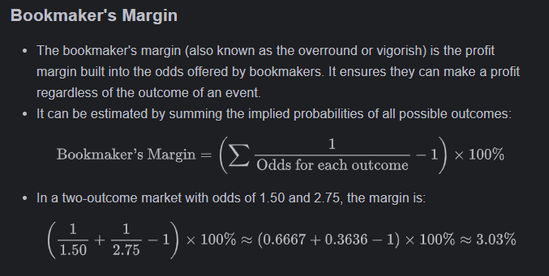

# Real-Time Betting Odds Monitor and Arbitrage Detection

1. **Understanding Betting Odds**
    - Odds represent the potential return on a bet.
    - **Example:** India (1.14), Australia (5.60).
    - Formula: **Payout = Bet Amount × Odds**.
    - Betting ₹200 on India at **1.14** returns ₹228 (₹28 profit if they win).
    - Betting ₹200 on Australia at **5.60** returns ₹1120 (₹920 profit if they win).


2. **Can You Bet on Both Teams and Always Win?**
    - This is called **arbitrage betting** (guaranteed profit regardless of the result).
    - It works if: India Odds - `a` and Australia Odds - `b`
      $$\frac{1}{a} + \frac{1}{b} < 1$$
    - If the condition is met, we can calculate the exact amounts to a bet on each team to ensure profit.
    - Example: With **1.14 & 15.60 odds**, you could bet ₹186.38 on India and ₹13.62 on Australia to guarantee a
      **₹198.85 profit**.


3. **How Are Betting Odds Set by Bookmakers?**
    - Odds are based on **implied probability**:
    - Probability = $$\frac{1}{Odds} $$
    - For **1.14 (India):** 87.72% probability
    - For **5.60 (Australia):** 17.86% probability
    - Total: **105.58%** (extra 5.58% is the bookmaker’s profit margin).
    - Bookmakers adjust odds based on market demand, betting patterns, and team conditions to ensure they always profit.


4. **Why Are Some Bets Always Profitable?**
    - **Rare cases** occur when bookmakers miscalculate odds, or betting shifts cause discrepancies.
    - Arbitrage opportunities arise when the sum of inverse odds is **less than 1**, allowing bettors to lock in
      guaranteed profit.

### **Conclusion**

- Betting odds include **bookmaker margins** to ensure they profit.
- **Arbitrage betting** is a way to guarantee profit by betting on both sides **if odds are favorable**.
- You can calculate the exact bets required for risk-free profit **only in certain situations**.
- You have to bet on two different instances to ensure profit.
- First bet is initialized at `x` odds on one team with `y` amount.
- Wait for the second bet to be available on the other team.

---

This project provides a real-time monitoring system for betting odds from Parimatch, coupled with an API to access this
data and basic arbitrage detection capabilities. It consists of three main components:

- **`main.py`**: A Flask API that scrapes live betting odds using Selenium and provides an endpoint to access the latest
  odds for a given event.
- **`arbitrage.py`**: A script that periodically fetches odds from the API and checks for potential arbitrage
  opportunities against a predefined initial bet.
- **`streamlit_ui.py`**: A Streamlit application that visualizes the real-time odds, probabilities, and bookmaker
  margins for a selected event.

## Overview

The system works by:

1. **Scraping Odds (`main.py`)**: A background thread uses Selenium to navigate the Parimatch website, extract the odds
   for a specific market (currently the first market listed), and continuously update the latest odds in memory.
2. **API Endpoint (`main.py`)**: A Flask API exposes an `/odds` endpoint that allows users to retrieve the latest odds
   for a given event ID. If odds for an event are not being actively monitored, the API starts a new monitoring thread
   for that event.
3. **Arbitrage Detection (`arbitrage.py`)**: This script periodically queries the `/odds` API endpoint. It compares the
   fetched odds against a pre-defined initial bet and calculates if an arbitrage opportunity exists. If found, it logs a
   notification.
4. **Real-time Visualization (`streamlit_ui.py`)**: A Streamlit application fetches the latest odds from the API at a
   set interval and displays them in real-time. It also calculates and visualizes the implied probabilities and the
   bookmaker's margin. Historical data is plotted to show trends over time.

## Key Features

- **Real-time Odds Updates**: Fetches and updates betting odds continuously.
- **Simple API**: Provides an easy-to-use API endpoint to retrieve the latest odds.
- **Arbitrage Detection**: Implements a basic check for arbitrage opportunities.
- **Probability Calculation**: Computes the implied probability for each outcome.
- **Bookmaker Margin Calculation**: Estimates the bookmaker's profit margin.
- **Interactive Visualization (Streamlit)**: Offers a dynamic web interface to view odds, probabilities, and historical
  trends.

## Getting Started

### Installation

1. **Clone the repository** (if you have one, otherwise just proceed with the next steps).
2. **Install the required Python packages:**

### Running the Applications

1. **Start the Flask API (`main.py`):**

   ```bash
   python main.py
   ```

   This will start the API server on `http://127.0.0.1:5000/`. You should see logging output indicating the server has
   started.

2. **Run the Arbitrage Checker (`arbitrage.py`)** (optional):

   Open a new terminal and run:

   ```bash
   python arbitrage.py
   ```

   This script will periodically check for arbitrage opportunities for the specified event.

3. **Run the Streamlit UI (`streamlit_ui.py`):**

   Open another new terminal and run:

   ```bash
   streamlit run streamlit_ui.py
   ```

   This will open a new tab in your web browser displaying the real-time odds' visualization.

## API Usage

### `/odds` Endpoint

- **Method:** `GET`
- **Parameters:**
    - `event` (required): The event ID to retrieve odds for (e.g., `gujarat-titans-punjab-kings-12844553`).
- **Response (JSON):**

    - If odds are available:
      ```json
      {
          "timestamp": 1683678900.123,
          "odds_t1": "1.50",
          "odds_t2": "2.75",
          "probability_t1": 0.6667,
          "probability_t2": 0.3636
      }
      ```
    - If the event is not being monitored yet:
      ```json
      {
          "message": "Fetching odds. Please try again in a few seconds."
      }
      ```
    - If the `event` parameter is missing:
      ```json
      {
          "error": "Event parameter is required."
      }
      ```

**Example Request:**

```
http://127.0.0.1:5000/odds?event=mumbai-indians-royal-challengers-bengaluru-12849059
```

## Understanding the Concepts

### Betting Odds

- Betting odds indicate the potential return on a wager relative to the stake. They are typically presented in decimal
  format (e.g., 1.50, 2.75).
- **Payout Calculation:** `Payout = Stake × Odds`
- For example, a ₹100 bet at odds of 1.50 yields a payout of ₹150 (₹50 profit), while the same ₹100 bet at odds of 2.75
  returns ₹275 (₹175 profit) if the selection wins.

### Implied Probability

- Implied probability is the likelihood of an event occurring as suggested by the betting odds. It is calculated as:
  $$ \text{Implied Probability} = \frac{1}{\text{Decimal Odds}} $$
- For odds of 1.50, the implied probability is $\frac{1}{1.50} \approx 0.6667$ or 66.67%.
- For odds of 2.75, the implied probability is $\frac{1}{2.75} \approx 0.3636$ or 36.36%.



### Arbitrage Betting

- Arbitrage betting (or "arbing") is a strategy where you place bets on all possible outcomes of an event with different
  bookmakers (or in this case, potentially exploiting temporary discrepancies in odds over time) in such a way that a
  profit is guaranteed, regardless of the result.
- A basic two-way arbitrage condition is met when the sum of the inverse of the odds for both outcomes is less than 1:
  $$ \frac{1}{\text{Odds}_1} + \frac{1}{\text{Odds}_2} < 1 $$
- The `arbitrage.py` script implements a simplified check against a fixed initial bet and the current opposing odds.
  True arbitrage often involves placing simultaneous bets on different bookmakers with varying odds.

## Potential Improvements

- **More Robust Market Selection**: Allow users to specify which market to monitor (e.g., "Match Winner," "Total
  Goals").
- **Multiple Bookmaker Support**: Extend the scraper to fetch odds from various betting platforms to identify more
  arbitrage opportunities.
- **Advanced Arbitrage Calculation**: Implement precise bet amount calculations for arbitrage based on available capital
  and odds.
- **Notification System**: Integrate alerts (e.g., email, Telegram) when arbitrage opportunities are detected.
- **Error Handling and Resilience**: Improve error handling in the scraping process to handle website changes or
  temporary issues.
- **Scalability**: Consider using more robust scraping frameworks or APIs if dealing with a large number of events or
  bookmakers.

## Disclaimer

This project is for educational and informational purposes only. Betting involves financial risk, and arbitrage
opportunities are not always readily available and may come with their own challenges and risks. Use this software
responsibly.